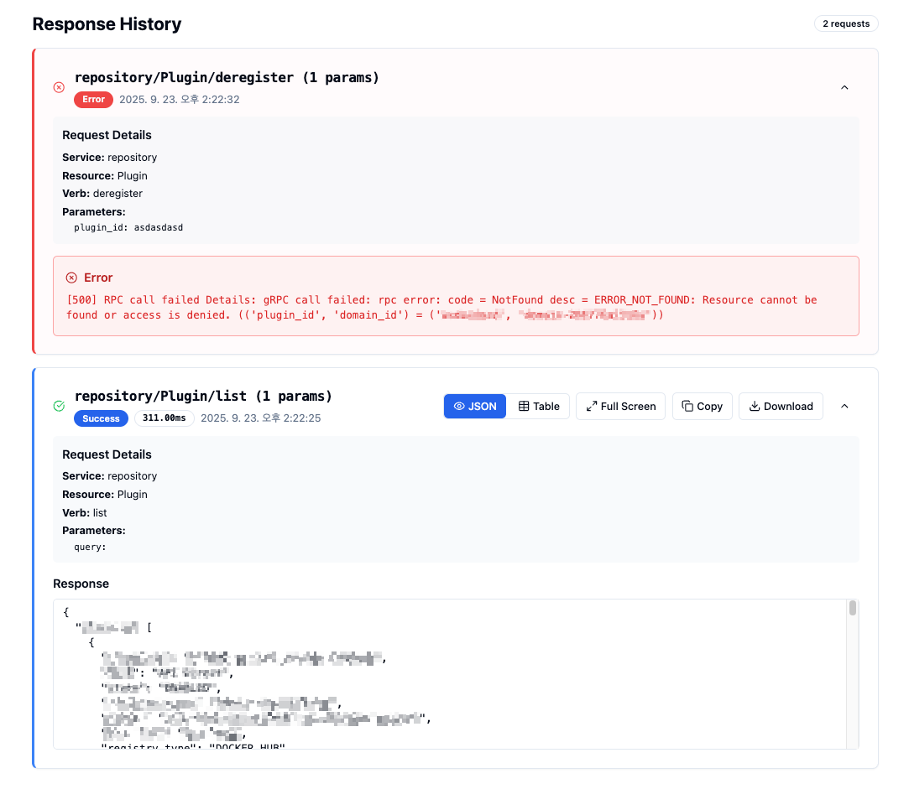

# SpaceONE gRPC API Client

A web-based client for testing and exploring SpaceONE's gRPC APIs with dynamic service discovery and interactive API testing capabilities.


## Quick Start

### Download and Run

```bash
# Download the latest release (compressed)
wget https://github.com/raccoon-mh/spacectl-web/releases/latest/download/spacectl-web.tar.gz

# Extract the compressed file
tar -xzf spacectl-web.tar.gz

# Make executable
chmod +x spacectl-web

# Run with your SpaceONE environment configuration
./spacectl-web --config ~/.spaceone/environments/<YOUR_ENV>.yml --port 8080

# open browser http://localhost:8080
```

### Access the web interface at http://localhost:8080

#### main page


#### config modal


#### response card



### Key Features

- **Dynamic Resource Discovery**: Automatically discovers available resources and verbs via gRPC reflection
- **Interactive Parameter Management**: Easy-to-use interface for adding and editing API parameters
- **Response History**: Quick access to previous API calls and responses
- **Cache Management**: Clear cached resources or response history with dedicated controls


# Dev
```
make dev
```
# build
```
make build
tar -czf spacectl-web.tar.gz spacectl-web
```